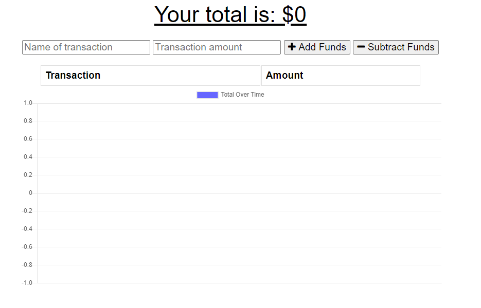
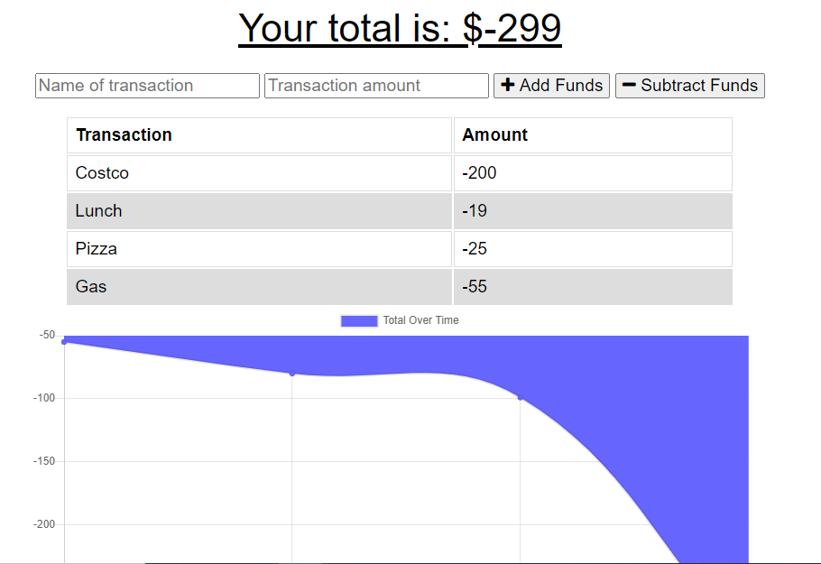

# Budget-Tracker

This budget tracker app allows users to keep track of their expenses. They enter a transation name, amount, then whether to add or subtract funds. A list of their transaction history is shown as well as a graph of their budget history. While this app works great online it can also be downloaded and used offline in case there is no internet connection. Users can still input more transactions offline and when there is connection again the app will sync up with IndexedDB and update their transactions list.

## Concepts used

This application is an example of a Progressive Web App (PWA) by using a manifest, service worker, and caching . In order to work offline the app makes use of a IndexedDB. While connected online the app uses Mongoose DB to store the transaction history.

## How it looks

- Heroku: https://salty-fjord-61225.herokuapp.com/
- GitHub repo: https://github.com/tlam1288/Budget-Tracker

